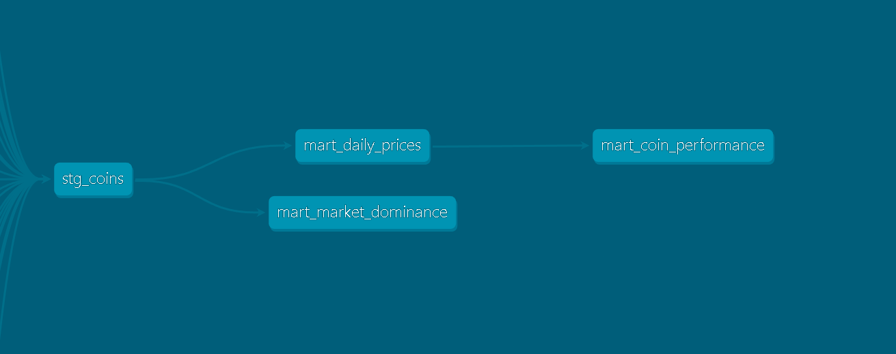

# Crypto Data Warehouse — dbt + DuckDB

Data warehouse built with dbt and DuckDB that models historical price data for 23 cryptocurrencies. Transforms 23 raw CSV files into structured analytical tables using a staging + marts architecture, with automated data quality tests on every model.

---

## Architecture

```
23 CSV seeds (raw data)
        │
        ▼
  [stg_coins]  ── Unifies all 23 CSVs into a single clean table
        │
        ├──▶ [mart_daily_prices]      ── Daily prices + return metrics + sentiment
        ├──▶ [mart_coin_performance]  ── Historical performance summary per coin
        └──▶ [mart_market_dominance]  ── Market cap dominance by coin and year
```



---

## Dataset

| Field | Detail |
|---|---|
| Source | Kaggle — Cryptocurrency Historical Prices |
| Coins | 23 (Bitcoin, Ethereum, Solana, Dogecoin, XRP, and more) |
| Coverage | 2013 – 2021 |
| Total rows | ~38,865 daily records |
| Columns per CSV | SNo, Name, Symbol, Date, High, Low, Open, Close, Volume, Marketcap |

---

## Models

### Staging

| Model | Type | Description |
|---|---|---|
| `stg_coins` | View | Unifies 23 seeds with UNION ALL, renames columns to snake_case, casts types and adds `coin_id` |

### Marts

| Model | Type | Description |
|---|---|---|
| `mart_daily_prices` | Table | Daily prices enriched with `daily_return_pct`, `price_range`, `day_sentiment` (Bullish/Bearish/Neutral) and temporal columns |
| `mart_coin_performance` | Table | Historical summary per coin: first/last price, total return %, ATH, ATL, best/worst day, bullish % |
| `mart_market_dominance` | Table | Market cap dominance % per coin per year, with yearly ranking |

---

## Data Tests

11 automated tests run with `dbt test` — all passing:

```
PASS  not_null_stg_coins_coin_id
PASS  not_null_stg_coins_name
PASS  not_null_stg_coins_symbol
PASS  not_null_stg_coins_date
PASS  not_null_stg_coins_close_price
PASS  not_null_mart_daily_prices_name
PASS  not_null_mart_daily_prices_date
PASS  not_null_mart_daily_prices_close_price
PASS  not_null_mart_coin_performance_name
PASS  unique_mart_coin_performance_name
PASS  not_null_mart_market_dominance_name

Done. PASS=11 WARN=0 ERROR=0 SKIP=0 NO-OP=0 TOTAL=11
```

---

## Key Findings

- **Bitcoin** dominance peaked at ~85% of total market cap in early years, declining to ~45% by 2021
- **Solana** achieved the highest total return in the dataset period despite starting later
- **Dogecoin** had the most extreme single-day return, driven by social media activity in 2021
- The number of **bullish days** (close > open) averages ~52% across all coins — slightly above 50%

---

## Project Structure

```
dbt-crypto-warehouse/
└── crypto_warehouse/
    ├── models/
    │   ├── staging/
    │   │   ├── stg_coins.sql
    │   │   └── schema.yml
    │   └── marts/
    │       ├── mart_daily_prices.sql
    │       ├── mart_coin_performance.sql
    │       ├── mart_market_dominance.sql
    │       └── schema.yml
    ├── seeds/
    │   └── coin_*.csv (23 files)
    ├── data/
    │   └── lineage_graph.png
    ├── tests/
    ├── dbt_project.yml
    └── README.md
```

---

## How to Reproduce

### Prerequisites
- Python 3.11
- dbt-core + dbt-duckdb installed

```bash
pip install dbt-core dbt-duckdb
```

### Steps

```bash
# 1. Clone the repository
git clone https://github.com/yustin-prz/dbt-crypto-warehouse.git
cd dbt-crypto-warehouse/crypto_warehouse

# 2. Load raw data into DuckDB
dbt seed

# 3. Build all models
dbt run

# 4. Run data quality tests
dbt test

# 5. Generate and serve documentation
dbt docs generate
dbt docs serve
# Open http://localhost:8080
```

---

## dbt Commands Reference

```bash
dbt seed          # Load CSVs into DuckDB
dbt run           # Build all models
dbt test          # Run data quality tests
dbt docs generate # Generate documentation
dbt docs serve    # Serve interactive docs + lineage graph
dbt build         # seed + run + test in one command
```

---

## Tools


---

## Author

**Yustin Eduardo Pérez Castro**  
[LinkedIn](https://www.linkedin.com/in/yustin-prz/) · [GitHub](https://github.com/yustin-prz)
